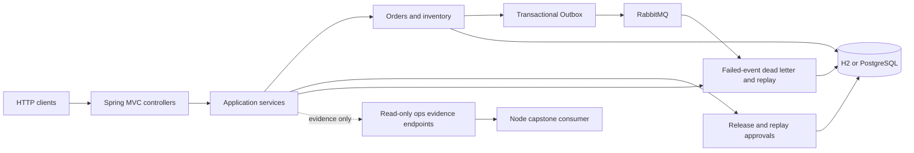

# Advanced Order Platform

[](https://github.com/wul012/javaproject/actions/workflows/maven-ci.yml)


Advanced Order Platform is a production-minded Java 21 and Spring Boot order system
with idempotent ordering, inventory consistency, simulated payments, a transactional
Outbox, RabbitMQ delivery, and approval-gated failed-event replay. Approval, replay,
rollback, SQL, and secret-access boundaries are guarded by mechanical tests or
fail-closed contracts. A Node-owned capstone has live-verified this application's
read-only evidence endpoints against a real Java jar; that evidence never grants
execution authority.

**Maturity:** `single-project validation + verified read-only cross-project integration (env-gated, single machine, no execution authority)`

这是一个以订单一致性和失败事件治理为主线的 Java 工程：下单、库存、模拟支付、
Outbox、RabbitMQ 与审批后重放都落在可测试的事务和权限边界内。跨项目验证只读取
Java 证据，不授权真实支付、密钥读取、SQL、部署、回滚或 managed audit 连接。

## Evidence at a glance

| Claim | Reproducible source |
| --- | --- |
| Full verification runs Spotless, JaCoCo package floors, shrink-only SpotBugs, production-profile smoke, and isolated Testcontainers jobs | [`maven-ci.yml`](.github/workflows/maven-ci.yml), [`pom.xml`](advanced-order-platform/pom.xml), [`JavaTrackCloseoutTests`](advanced-order-platform/src/test/java/com/codexdemo/orderplatform/maintainability/JavaTrackCloseoutTests.java) |
| The preregistered direct-root extraction moved from **805 → 104**, with 104 retained and 0 movable or unassigned files | [`ops-root-census.ps1`](advanced-order-platform/scripts/ops-root-census.ps1), [progress ledger](advanced-order-platform/docs/production-excellence-progress.md), [final evidence](advanced-order-platform/docs/java-track-final-evidence.md) |
| Production Java is capped at **658 lines**; files **>750 / >1000 = 0 / 0**; there are no source-size waivers | [`java-maintainability-census.ps1`](advanced-order-platform/scripts/java-maintainability-census.ps1), [`JavaMaintainabilityBudgetTests`](advanced-order-platform/src/test/java/com/codexdemo/orderplatform/maintainability/JavaMaintainabilityBudgetTests.java) |
| Four consecutive clean ledger cycles record local verify, immutable commit, and green remote CI evidence | [production-excellence ledger](advanced-order-platform/docs/production-excellence-progress.md) |

## Architecture and authority



The diagram separates evidence from authority. Readiness, rehearsal, digest, and
capstone responses describe state; they do not execute replay, deployment, rollback,
SQL, secret resolution, or managed-audit connections. The complete threat model and
runtime limits are recorded in
[`PRODUCTION_READINESS.md`](advanced-order-platform/PRODUCTION_READINESS.md).

## Verify it

Run from `advanced-order-platform/`:

```powershell
.\scripts\ops-root-census.ps1 -Json
.\scripts\java-maintainability-census.ps1 -Json
.\scripts\archive-retention-census.ps1 -Json
.\mvnw.cmd -B verify
```

## Full project documentation

The full project docs live in [`advanced-order-platform/`](advanced-order-platform/README.md).
Start with the [Java-track evidence](advanced-order-platform/docs/java-track-final-evidence.md),
[progress ledger](advanced-order-platform/docs/production-excellence-progress.md), and
[README exhibition brief](advanced-order-platform/docs/readme-exhibition-brief.md).
