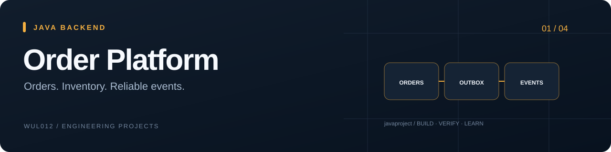
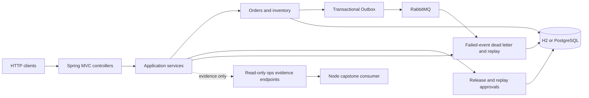

# Advanced Order Platform

**Java 订单后端**：围绕订单、库存和消息一致性构建的 Spring Boot 工程原型。



[](https://github.com/wul012/javaproject/actions/workflows/maven-ci.yml)
**Java 21 · Spring Boot · JPA · PostgreSQL · RabbitMQ**

A modular order backend with idempotency, inventory transactions and event delivery.

[快速开始](#快速开始) · [代码入口](#代码入口) · [验证与范围](#验证与范围) · [完整历史](#engineering-history)

## 核心能力

- **交易流程** — 下单、模拟支付、退款、取消、发货与完成；库存预占、扣减和回补纳入事务。
- **一致性机制** — 幂等键与请求指纹、库存锁、Transactional Outbox、消息去重和重试。
- **失败处理** — 失败事件查询与审批后重放（approval-gated failed-event replay），以及只读运维证据。

## 快速开始

需要 JDK 21；Maven Wrapper 固定工具版本。默认使用 H2，启动后访问 [健康检查](http://127.0.0.1:8080/actuator/health)。PostgreSQL / RabbitMQ 配置见[完整说明](advanced-order-platform/README.md)。

```powershell
cd advanced-order-platform
.\mvnw.cmd spring-boot:run
```

## 代码入口

[业务入口](advanced-order-platform/src/main/java/com/codexdemo/orderplatform/order/OrderApplicationService.java) · [测试目录](advanced-order-platform/src/test/java/com/codexdemo/orderplatform) · [运行与配置](advanced-order-platform/README.md)

## 验证与范围

[v1900 验证记录](advanced-order-platform/docs/ops/order-create-ordering-v1900.md)：2,043 项本地测试通过；这是该版本的结果，不是本次重跑业务测试。

支付为模拟流程。只读 readiness / evidence 不代表部署、回滚、SQL 或密钥访问授权；完整范围见[运行边界](advanced-order-platform/PRODUCTION_READINESS.md)。

<details>
<summary>展开更多验证 / 实验命令</summary>

```powershell
cd advanced-order-platform
.\mvnw.cmd -B verify
```

</details>

## 关联项目

四个独立工程，各自可读、可运行；不是把四种语言放进一个目录的演示。

[OrderOps Console](https://github.com/wul012/nodeproj) · [mini-kv](https://github.com/wul012/mini_kv) · [MiniGPT Lab](https://github.com/wul012/aiproj)

<a id="engineering-history"></a>
<details>
<summary>历史证据与完整维护手册（点击展开）</summary>

以下保留原始文档。版本号、测试数量和研究结论沿用其原始时点，不是本次门面整理的实测结果。

# Advanced Order Platform

[](https://github.com/wul012/javaproject/actions/workflows/maven-ci.yml)


Advanced Order Platform is a production-minded Java 21 and Spring Boot order system
with idempotent ordering, inventory consistency, simulated payments, a transactional
Outbox, RabbitMQ delivery, and approval-gated failed-event replay. Approval, replay,
rollback, SQL, and secret-access boundaries are guarded by mechanical tests or
fail-closed contracts. A Node-owned capstone has live-verified this application's
read-only evidence endpoints against a real Java jar; that evidence never grants
execution authority.

**Maturity:** `single-project validation + verified read-only cross-project integration (env-gated, single machine, no execution authority)`

这是一个以订单一致性和失败事件治理为主线的 Java 工程：下单、库存、模拟支付、
Outbox、RabbitMQ 与审批后重放都落在可测试的事务和权限边界内。跨项目验证只读取
Java 证据，不授权真实支付、密钥读取、SQL、部署、回滚或 managed audit 连接。

## Evidence at a glance

| Claim | Reproducible source |
| --- | --- |
| Full verification runs Spotless, JaCoCo package floors, shrink-only SpotBugs, production-profile smoke, and isolated Testcontainers jobs | [`maven-ci.yml`](.github/workflows/maven-ci.yml), [`pom.xml`](advanced-order-platform/pom.xml), [`JavaTrackCloseoutTests`](advanced-order-platform/src/test/java/com/codexdemo/orderplatform/maintainability/JavaTrackCloseoutTests.java) |
| The preregistered direct-root extraction moved from **805 → 104**, with 104 retained and 0 movable or unassigned files | [`ops-root-census.ps1`](advanced-order-platform/scripts/ops-root-census.ps1), [progress ledger](advanced-order-platform/docs/production-excellence-progress.md), [final evidence](advanced-order-platform/docs/java-track-final-evidence.md) |
| Production Java is capped at **658 lines**; files **>750 / >1000 = 0 / 0**; there are no source-size waivers | [`java-maintainability-census.ps1`](advanced-order-platform/scripts/java-maintainability-census.ps1), [`JavaMaintainabilityBudgetTests`](advanced-order-platform/src/test/java/com/codexdemo/orderplatform/maintainability/JavaMaintainabilityBudgetTests.java) |
| Four consecutive clean ledger cycles record local verify, immutable commit, and green remote CI evidence | [production-excellence ledger](advanced-order-platform/docs/production-excellence-progress.md) |

## Architecture and authority



The diagram separates evidence from authority. Readiness, rehearsal, digest, and
capstone responses describe state; they do not execute replay, deployment, rollback,
SQL, secret resolution, or managed-audit connections. The complete threat model and
runtime limits are recorded in
[`PRODUCTION_READINESS.md`](advanced-order-platform/PRODUCTION_READINESS.md).

## Verify it

Run from `advanced-order-platform/`:

```powershell
.\scripts\ops-root-census.ps1 -Json
.\scripts\java-maintainability-census.ps1 -Json
.\scripts\archive-retention-census.ps1 -Json
.\mvnw.cmd -B verify
```

## Full project documentation

The full project docs live in [`advanced-order-platform/`](advanced-order-platform/README.md).
Start with the [Java-track evidence](advanced-order-platform/docs/java-track-final-evidence.md),
[progress ledger](advanced-order-platform/docs/production-excellence-progress.md), and
[README exhibition brief](advanced-order-platform/docs/readme-exhibition-brief.md).

</details>
