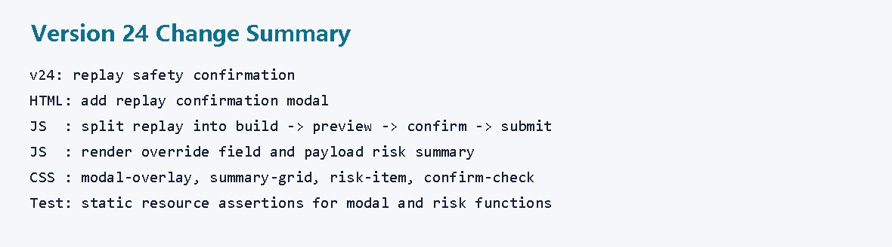
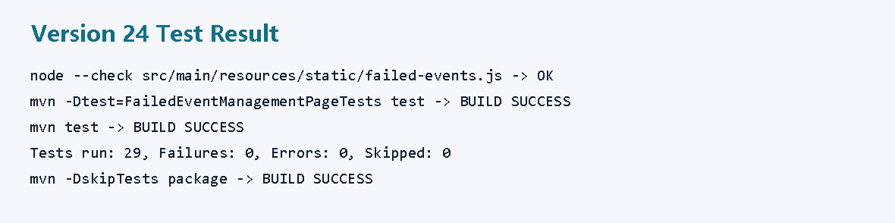
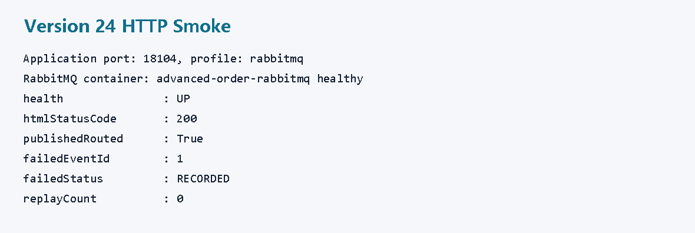
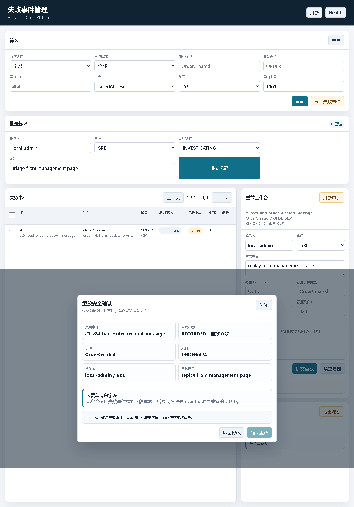
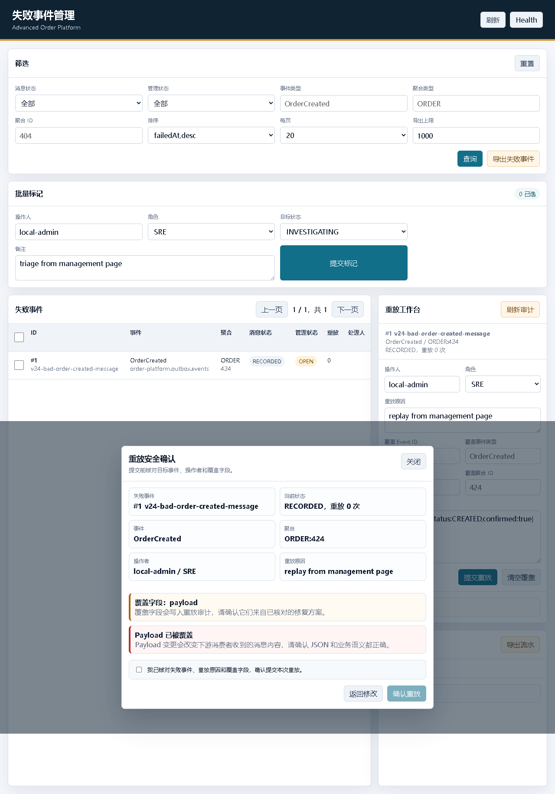
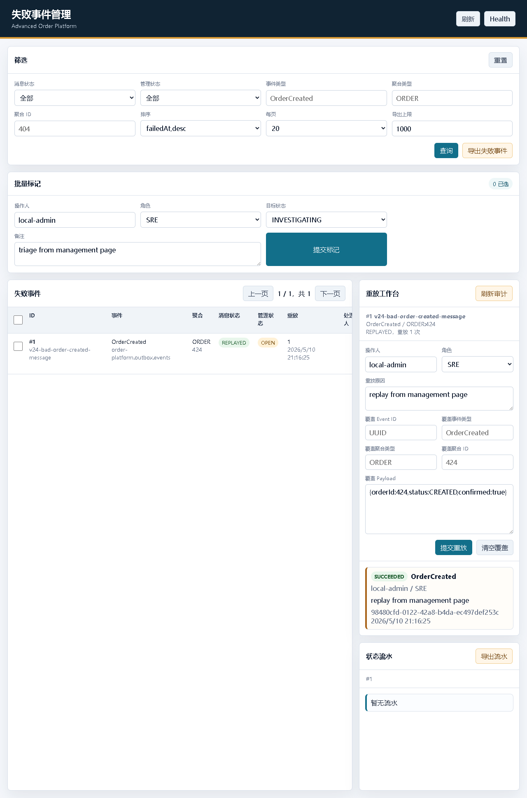
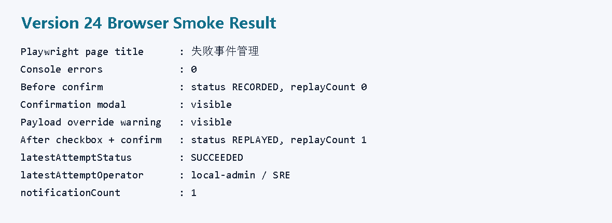
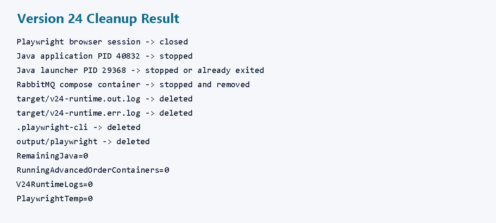

# v24 开发运行调试记录：重放二次确认和风险提示

## 本轮目标

v23 已经能在失败事件管理页面里直接发起重放。v24 继续补安全边界：

```text
提交重放前先弹出确认窗口
展示失败事件、操作者、原因和覆盖字段
覆盖 Payload 时给出高风险提示
必须勾选确认后才真正请求后端
```



## 代码改动

### 1. HTML 新增确认弹窗

文件：

```text
src/main/resources/static/failed-events.html
```

新增：

```html
<div id="replayConfirmOverlay" class="modal-overlay" hidden>
    <section class="modal" role="dialog" aria-modal="true" aria-labelledby="replayConfirmTitle">
        ...
        <div id="replayConfirmSummary" class="confirm-summary"></div>
        <div id="replayRiskList" class="risk-list"></div>
        ...
        <button id="replayConfirmSubmitButton" class="primary-button" type="button" disabled>确认重放</button>
    </section>
</div>
```

作用：

```text
replayConfirmSummary
 -> 重放摘要

replayRiskList
 -> 风险列表

replayConfirmCheckbox
 -> 显式确认

replayConfirmSubmitButton
 -> 真正提交，默认 disabled
```

### 2. JS 拆分重放流程

文件：

```text
src/main/resources/static/failed-events.js
```

v24 将重放动作拆成四步：

```text
replayActiveEvent()
 -> buildReplayRequest()
 -> openReplayConfirm()
 -> confirmReplaySubmission()
 -> submitReplayRequest()
```

第一次点击“提交重放”只执行：

```javascript
const replayRequest = buildReplayRequest(id);
openReplayConfirm(replayRequest);
```

真正的 HTTP 请求被挪到：

```javascript
async function submitReplayRequest(replayRequest) {
    const { id, body, operatorId, operatorRole } = replayRequest;
    const response = await fetch(`${apiBase}/${id}/replay`, {
        method: "POST",
        headers: {
            "Content-Type": "application/json",
            "X-Operator-Id": operatorId,
            "X-Operator-Role": operatorRole
        },
        body: JSON.stringify(body)
    });
}
```

### 3. JS 新增风险列表

文件：

```text
src/main/resources/static/failed-events.js
```

无覆盖字段：

```javascript
title: "未覆盖消息字段"
```

覆盖字段：

```javascript
title: `覆盖字段：${overrideFields.join(", ")}`
```

覆盖 Payload：

```javascript
title: "Payload 已被覆盖"
level: "risk-high"
```

已重放事件再次提交：

```javascript
title: "当前事件已经重放成功"
description: "后端会保护性跳过再次投递，并记录 SKIPPED_ALREADY_REPLAYED 审计。"
```

### 4. CSS 新增弹窗样式

文件：

```text
src/main/resources/static/failed-events.css
```

新增样式：

```css
.modal-overlay
.modal
.modal-heading
.summary-grid
.risk-item
.risk-medium
.risk-high
.confirm-check
.modal-actions
.primary-button:disabled
```

### 5. 页面资源测试补充

文件：

```text
src/test/java/com/codexdemo/orderplatform/FailedEventManagementPageTests.java
```

新增断言：

```java
"replayConfirmOverlay",
"replayConfirmCheckbox",
"replayConfirmSubmitButton",
"openReplayConfirm",
"confirmReplaySubmission",
"replayRisks",
".modal-overlay",
".risk-high",
".confirm-check"
```

## 测试结果

JS 语法：

```powershell
node --check src\main\resources\static\failed-events.js
```

结果：

```text
exit code 0
```

页面资源测试：

```powershell
mvn -Dtest=FailedEventManagementPageTests test
```

结果：

```text
Tests run: 1, Failures: 0, Errors: 0, Skipped: 0
BUILD SUCCESS
```

全量测试：

```powershell
mvn test
```

结果：

```text
Tests run: 29, Failures: 0, Errors: 0, Skipped: 0
BUILD SUCCESS
```

打包：

```powershell
mvn -DskipTests package
```

结果：

```text
BUILD SUCCESS
target/advanced-order-platform-0.1.0-SNAPSHOT.jar
```



## HTTP 冒烟

启动 RabbitMQ：

```powershell
docker compose -f compose.yaml up -d rabbitmq
```

启动应用：

```powershell
java -jar target\advanced-order-platform-0.1.0-SNAPSHOT.jar `
  --spring.profiles.active=rabbitmq `
  --server.port=18104
```

本轮进程：

```text
Java 应用 PID 40832
Java 启动代理 PID 29368
```

HTTP 冒烟结果：

```text
health               : UP
htmlStatusCode       : 200
publishedRouted      : True
failedEventId        : 1
failedEventMessageId : v24-bad-order-created-message
failedStatus         : RECORDED
replayCount          : 0
eventType            : OrderCreated
aggregateId          : 424
```



## 浏览器冒烟

使用 Playwright 打开：

```text
http://localhost:18104/failed-events.html
```

### 第一次提交：只弹确认，不重放

点击表格行内“重放”，再点击右侧“提交重放”。

页面显示：

```text
重放安全确认
失败事件 #1 v24-bad-order-created-message
当前状态 RECORDED，重放 0 次
未覆盖消息字段
确认重放按钮默认 disabled
```

此时 API 验证：

```text
statusBeforeConfirm      : RECORDED
replayCountBeforeConfirm : 0
```



### 覆盖 Payload：出现高风险提示

返回修改，填写覆盖 Payload，再点击“提交重放”。

页面显示：

```text
覆盖字段：payload
Payload 已被覆盖
确认重放按钮仍然需要勾选确认项后才启用
```



### 勾选确认后真正重放

勾选确认项，点击“确认重放”。

页面刷新后显示：

```text
消息状态：REPLAYED
重放次数：1
重放审计：SUCCEEDED
操作者：local-admin / SRE
```



最终 API 验证：

```text
finalStatus              : REPLAYED
replayCount              : 1
lastReplayEventId        : 98480cfd-0122-42a8-b4da-ec497def253c
attemptCount             : 1
latestAttemptStatus      : SUCCEEDED
latestAttemptOperator    : local-admin / SRE
latestAttemptReason      : replay from management page
notificationCount        : 1
firstNotificationEventId : 98480cfd-0122-42a8-b4da-ec497def253c
```

浏览器控制台：

```text
Errors: 0
Warnings: 0
```



## 清理结果

本轮结束前执行清理：

```text
Playwright 浏览器会话
 -> 已关闭

Java 应用 PID 40832
 -> 已停止

Java 启动代理 PID 29368
 -> 已停止或已随应用退出

RabbitMQ compose 容器 advanced-order-rabbitmq
 -> 已停止并移除

临时运行日志
 -> target/v24-runtime.out.log 已删除
 -> target/v24-runtime.err.log 已删除

Playwright 临时目录
 -> .playwright-cli 已删除
 -> output/playwright 已删除
```



## v24 结论

v24 把失败事件重放从“页面按钮直接执行”升级成了：

```text
预览
 -> 风险提示
 -> 显式确认
 -> 再提交
```

这让项目更接近真实生产运维工具：高风险动作仍然能做，但不能悄悄做。
