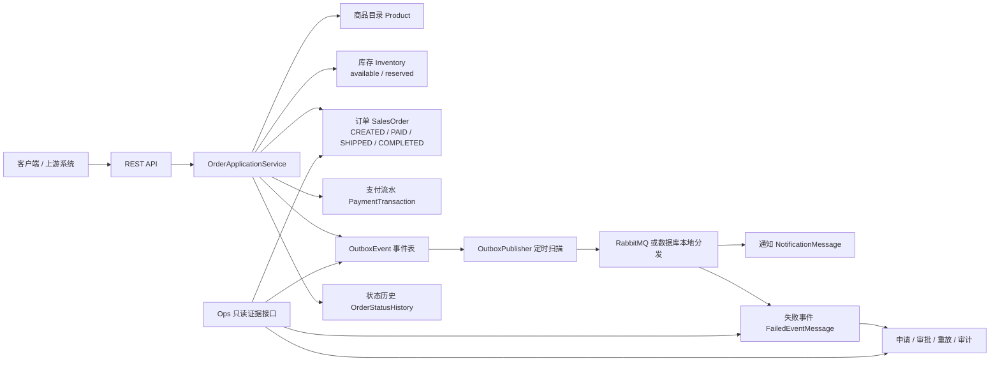
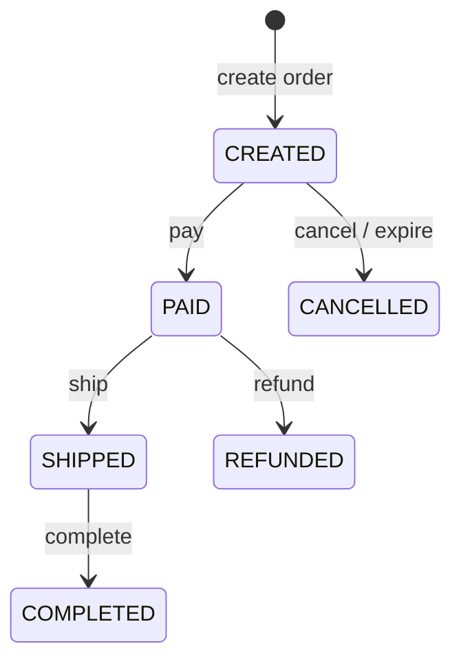
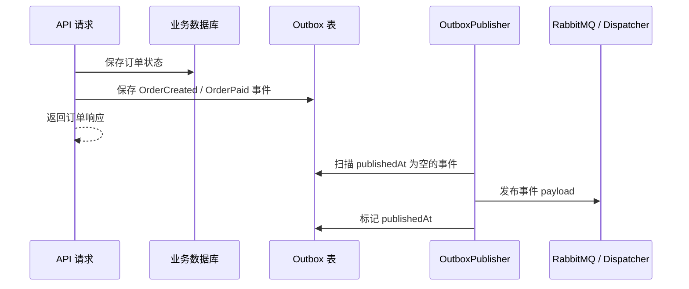

# Advanced Order Platform 项目说明：价值、输入输出与透明机理

这个 Java 项目不是一个普通的“订单 CRUD 示例”，而是在做一个订单交易生产雏形。它模拟真实电商、交易平台、履约系统里最难稳住的几件事：下单不能重复，库存不能超卖，状态不能乱跳，消息不能丢，失败事件要能审计后重放，上线前要有可读、可验证的证据。

## 一张全景图



## 它到底在做什么

最通俗地说，它在模拟“一个订单从用户提交，到库存占用，到支付确认，到消息通知，到失败可补偿”的完整后台链路。

用户看到的是订单接口，例如创建订单、支付、退款、取消、发货、完成。系统内部真正做的事情更多：查商品、计算金额、锁库存、记录状态历史、生成支付流水、写出可靠事件、后台发布事件、消费通知、记录失败消息，并给运维或上游系统提供只读证据。

所以它的重点不只是“能下单”，而是“下单这件事在真实生产里能不能安全、可追踪、可恢复”。

## 有价值的地方在哪里

第一层价值是交易正确性。用户可能因为网络抖动点两次提交，客户端也可能重试同一个请求。系统用 `Idempotency-Key` 和请求指纹判断：同一个 key、同一个请求就返回旧订单；同一个 key、不同请求就拒绝。这样可以避免重复下单、重复扣库存、重复写事件。

第二层价值是库存一致性。项目没有把库存简单写成 `stock -= quantity`，而是拆成 `available` 和 `reserved` 两本账。下单先预留库存，支付才确认扣减；取消或过期会释放预留，退款会返还已扣库存。这比单字段库存更接近真实交易系统。

第三层价值是可靠事件。订单创建、支付、退款等动作不会直接“数据库改完之后顺手发消息”，而是先把事件写进 `outbox_events` 表，再由后台发布器扫描发布。这样即使 RabbitMQ 或下游通知系统暂时不可用，事件也不会从业务数据库里消失。

第四层价值是失败可治理。消息消费失败后，系统会记录失败事件，并支持查询、筛选、导出、管理状态、申请重放、审批重放、执行前 readiness/simulation/contract 检查。也就是说，它不是只追求“正常路径跑通”，还在训练“出事以后怎么稳住”。

第五层价值是生产证据。项目里有大量 ops/readiness/evidence 接口和文档，用来说明当前版本有哪些能力、哪些边界、哪些地方只能只读、哪些动作被禁止。这些证据可以给 Node 上游、运维页面、审计链路或后续自动化检查消费。

## 用一个例子说明每一步输入和输出

假设商品 `productId=1`，单价 `199.00`，库存初始是：

```text
available = 10
reserved = 0
```

用户要买 2 件，发送创建订单请求：

```http
POST /api/v1/orders
Idempotency-Key: demo-order-001
```

```json
{
  "customerId": "11111111-1111-1111-1111-111111111111",
  "items": [
    { "productId": 1, "quantity": 2 }
  ]
}
```

这一步的输入是客户 ID、商品 ID、数量和幂等 key。系统内部会先校验幂等 key，再计算请求指纹，然后查商品价格，聚合商品数量，预留库存，保存订单，记录状态历史，写入 outbox 事件。

输出大致是：

```json
{
  "id": 101,
  "customerId": "11111111-1111-1111-1111-111111111111",
  "status": "CREATED",
  "totalAmount": 398.00,
  "lines": [
    {
      "productId": 1,
      "productName": "example product",
      "unitPrice": 199.00,
      "quantity": 2,
      "lineTotal": 398.00
    }
  ]
}
```

库存账变成：

```text
available = 8
reserved = 2
```

这里的机理是：货还没真正卖掉，只是先占住，避免别人同时买走。

如果用户网络抖动，又用同一个 `Idempotency-Key` 发一模一样的请求，系统不会创建第二个订单，而是返回旧订单。输出语义是：

```text
HTTP 200 OK
replayed = true
orderId = 101
```

如果同一个 key 换了别的商品或数量，系统会拒绝，因为这说明客户端把“同一次操作编号”拿去做了另一件事。这是幂等保护的关键。

支付时，用户或上游系统发送：

```http
POST /api/v1/orders/101/pay
```

输入只有订单 ID。系统会找到订单，检查状态是不是 `CREATED`，然后把订单改成 `PAID`，把预留库存确认扣减，写支付成功流水，写状态历史，写 `OrderPaid` outbox 事件。

输出大致是：

```json
{
  "id": 101,
  "status": "PAID",
  "totalAmount": 398.00
}
```

库存账变成：

```text
available = 8
reserved = 0
```

原因是那 2 件货已经从“预留”转成“确认售出”。

如果用户退款：

```http
POST /api/v1/orders/101/refund
```

系统会把订单从 `PAID` 改成 `REFUNDED`，写退款流水，返还已扣库存，写 `OrderRefunded` 事件。

库存账变回：

```text
available = 10
reserved = 0
```

## 状态机



这张状态图的意义是防止乱跳。未支付不能发货，已取消不能支付，已发货后不能按这个简化链路直接退款。状态机把业务规则固化在代码里，避免接口被随意调用后产生不一致数据。

## Outbox 机制为什么重要

真实系统里，一个订单支付成功后，通常要通知很多下游：通知服务、营销服务、风控服务、仓储服务、财务服务。如果业务代码在事务里直接发消息，会遇到经典问题：

```text
订单写库成功，但消息发送失败
```

或者反过来：

```text
消息发出去了，但订单事务回滚
```

这个项目用 outbox 表把问题拆开。业务事务只负责两件事：改订单、写事件。后台发布器再扫描未发布事件，发到 RabbitMQ 或本地分发器。发布成功后标记 `publishedAt`。这样事件有数据库托底，失败也能被发现和补偿。

流程可以理解为：



## 失败事件治理在做什么

如果 RabbitMQ 消费或通知处理失败，系统不会只打印日志就算了，而是把失败消息记录为 `FailedEventMessage`。这类失败事件后续可以被查询、筛选、导出、标记管理状态、申请重放、审批、模拟重放、执行重放。

这套机制的价值在于：失败不再是散落在日志里的文本，而是可查询、可审批、可审计的数据。

一个失败事件大概会经历：

```text
RECORDED -> 申请重放 -> 审批通过 -> 执行重放 -> REPLAYED
```

如果条件不满足，readiness 接口会告诉操作者为什么不能重放，例如已经重放过、审批未通过、管理状态关闭、请求条件不满足等。

## Ops 只读证据层的意义

项目里有很多 `ops`、`readiness`、`evidence`、`handoff` 类接口。它们不是核心下单功能，而是生产治理层。它们回答的问题是：

- 当前系统有哪些能力已经具备？
- 哪些动作只是只读预演，不能真的执行？
- 哪些证据可以给 Node 上游消费？
- 哪些边界明确禁止，例如真实 credential、真实 endpoint、真实部署/回滚？
- 某个版本的 CI、文档、测试、证据归档是否完整？

这类东西从业务用户角度看不显眼，但对工程后期很有价值。因为系统越大，越需要知道“这个版本到底承诺了什么，没有承诺什么”。

## 每类接口的输入输出

商品目录接口的输入通常是查询请求，输出是产品列表。它回答“能买什么”。

订单接口的输入是客户、商品、数量、订单动作，输出是订单状态、金额、订单行、时间字段。它回答“这笔交易现在走到哪一步”。

库存接口的输入是商品 ID，输出是库存流水。它回答“库存为什么从 10 变成 8，又为什么从 reserved 变成 committed”。

支付接口不直接暴露复杂第三方网关，而是模拟支付成功和退款流水。它回答“这笔订单有没有形成支付记录”。

Outbox 接口的输出是最近事件和发布状态。它回答“业务变化有没有留下要通知下游的事件”。

失败事件接口的输入是筛选条件、事件 ID、管理动作、重放申请或审批动作，输出是失败事件、审计历史、可执行动作、阻断原因。它回答“出事后能不能安全处理”。

Ops 证据接口多数是只读输入，输出是证据包、清单、边界说明、版本说明。它回答“这个系统当前生产准备度如何”。

## 一句话总结

这个项目的核心价值是：用一个订单平台，把交易一致性、可靠消息、失败补偿、审计审批和运维证据串成一条可验证链路。业务输入是商品、客户、订单动作；业务输出是订单状态、库存账、支付流水、事件和审计记录；治理输出是 readiness、simulation、evidence、approval 等只读证据，让后续 Node 或运维界面可以判断 Java 当前到底安不安全、能不能继续推进。
