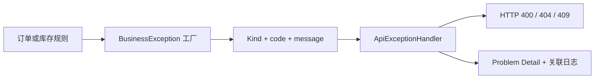

# v1870：把 HTTP 从业务核心里拿出去，并借机压平重复控制流

## 入口路由

表面看，原代码能够正确返回 400、404 和 409，也能完成下单、库存预留、支付、取消和过期订单处理，因此这不是一次修复线上故障的版本。问题藏在依赖方向里：`BusinessException` 直接保存 Spring 的 `HttpStatus`，`SalesOrder`、`InventoryItem`、`InventoryService` 和 `OrderApplicationService` 为了抛出业务错误，也都必须导入 Spring HTTP 类型。这样一来，一个本来只应描述“数量非法”“库存不足”“订单不存在”的业务决定，被迫同时决定 Web 层如何编码响应。业务对象不能脱离 Spring Web 单独阅读，未来若同一套业务逻辑由消息消费者、批处理命令或其他协议调用，也会继续携带一个并不属于它的 HTTP 概念。

本版的输入是业务失败的三个稳定语义：输入非法、资源冲突、目标不存在；输出仍是客户端已经依赖的 400、409、404，以及原有错误码、消息、Problem Detail 类型地址和关联日志。中间增加的不是一层空壳，而是一条清楚的翻译边界：核心只产生 `BusinessException.Kind`，`ApiExceptionHandler` 在最外侧把它翻译成 `HttpStatus`。这使“业务为什么拒绝”与“HTTP 怎样表达拒绝”分开演化，同时不改变任何路由、请求体、响应字段、数据库结构和运行权限。

## 响应模型

修改前的调用链可以写成：领域对象发现规则不满足，直接构造 `BusinessException(HttpStatus, code, message)`，异常处理器再从异常里取回已经决定好的状态。看似省了一次映射，实质上是让内层依赖外层。`HttpStatus` 属于 Spring Web；领域实体却知道它，这等于让仓库最稳定的业务概念依赖最容易替换的传输框架。依赖倒置并不要求到处建立接口，它首先要求把变化频率不同的概念放回各自边界。

修改后的链路是：领域对象调用 `BusinessException.invalidInput`、`conflict` 或 `notFound`，异常内部保存局部枚举 `Kind`、稳定错误码和消息；请求到达 Web 异常处理器后，穷尽 `switch` 将三种 `Kind` 映射为 HTTP 状态。枚举放在异常内部，而不是创建一个散落在 `common` 包里的宽泛全局类型，是经过收敛后的选择：这个分类只服务业务异常，不需要假装成全系统通用分类；调用方通过三个命名工厂表达意图，通常甚至不需要直接引用枚举。

图中左半边完全不认识 Spring HTTP，右半边也不修改业务错误码。输入和输出之间唯一新增的行为是可见、穷尽、可测试的映射，而不是隐式约定或字符串判断。

## 上游证据配置

`BusinessException` 现在是 `final`，避免子类悄悄改变错误类别或错误码的含义。它保存三个数据：`Kind` 说明拒绝属于哪一类，`code` 是客户端和日志可长期识别的稳定机器码，父类的 `message` 提供面向人的上下文。这里没有把错误码直接替换成枚举，因为现有项目已有 `EMPTY_ORDER`、`ORDER_STATUS_INVALID`、`INVENTORY_NOT_FOUND` 等更细粒度合同；`Kind` 负责传输层分类，`code` 负责业务原因，两者粒度不同，不能合并。

三个静态工厂也不是单纯为了少写 `new`。调用 `invalidInput("INVALID_QUANTITY", ...)` 时，代码首先读到的是业务意图；调用方无法传入一个任意 HTTP 状态，也无法制造“错误类别与工厂名称不一致”的对象。构造器保持私有，类别的创建入口因此是封闭的。以后若新增例如“暂时不可用”的业务类别，编译器会要求 Handler 的 `switch` 同步处理，而不是让某个调用点直接塞入 503 后悄悄绕开边界。

原有 `getCode()` 保留，避免无意义地破坏测试和调用合同；新增 `getKind()` 只为适配器读取分类。异常消息、错误码和 Problem Detail 类型地址没有重写，也没有用新的抽象掩盖旧行为。这样的重构价值在于改变依赖，而不是制造 API churn。

## 服务层核心流程

`ApiExceptionHandler.handleBusinessException` 收到异常后，先调用私有的 `statusFor`。这个方法使用 Java 21 的穷尽式 `switch`：`INVALID_INPUT` 对应 `BAD_REQUEST`，`CONFLICT` 对应 `CONFLICT`，`NOT_FOUND` 对应 `NOT_FOUND`。没有 `default` 分支是刻意的；新增枚举值而没有明确 HTTP 语义时，编译必须失败。相比一个可漏项的 Map 或根据错误码前缀猜状态，编译期穷尽检查更透明。

映射结果随后同时进入日志与 Problem Detail。日志仍打印 `code`、数值状态、`traceId` 和 `spanId`；Problem Detail 仍把错误码设为标题，把原消息设为 detail，并使用 `https://advanced-order-platform/errors/<code>` 作为类型地址。也就是说，请求输入不变，客户端看到的状态、标题、详情和类型地址不变，运维人员检索的关联字段也不变。变化只发生在服务器内部决定状态的位置。

`ApiExceptionHandlerTests` 新增一项覆盖三种类别的测试，并保留原有约束校验测试。测试不仅断言 400、409、404，还断言标题、详情、类型地址和日志文本，因此不能通过只返回“差不多的状态”蒙混过关。原测试方法名超过四十字符，本版触碰该文件时同步缩短为 `mapsConstraintViolations`，落实童子军规则，而不是把存量长名继续带过下一版。

## Java 证据检查

第一次实现通过了业务测试，却被 v1869 的源码增长门拒绝：生产差异是 `+602/-562`。新增业务逻辑本身并没有六百行，主要原因是这些早期核心文件首次被 Spotless 规范化，四空格旧格式与当前两空格格式形成了大面积替换。但门禁拒绝得正确：不能因为可以解释差异，就立刻修改门禁或提高上限。被触碰文件里确实存在四套几乎相同的库存遍历，以及三处相同的正数量校验，正好应在本版偿还。

`InventoryService` 原来的 `reserve`、`commitReserved`、`returnCommitted`、`releaseReserved` 都重复“按产品编号排序、逐项取编号和数量、调用 `applyAndRecord`”的骨架。现在 `applyAll` 独占这个算法，变化部分由 `BiConsumer<InventoryItem, Integer>` 传入。四个公共方法只声明动作类型和实体方法引用。排序没有丢失，所以多产品加锁顺序仍稳定；movement 类型、变更前快照和持久化也仍集中在 `applyAndRecord`。输入仍是产品到数量的 Map，输出仍是库存状态和 movement 记录，只有重复控制流被折叠。

`findLocked` 与 `findExisting` 分别选择加锁查询和普通查询，然后都交给 `requireInventory` 处理空值和稳定错误。它没有把两种查询强行合成一个布尔参数，因为“是否加锁”是仓储访问策略，不应藏在真假值里；只共享相同的结果校验。这个拆分保留了读写语义，又去掉了两份相同的 404 构造代码。

## mini-kv 证据检查

本版没有读取、启动、停止或改写 mini-kv，也没有改变任何跨项目 fixture 与摘要。本节保留标准讲解结构中的 mini-kv 证据检查，给出的结论是明确的负证据：错误分类、状态迁移和库存重构都由 Java 本地数据库测试证明，不把冻结文件假装成运行时联调结果。`InventoryItem` 把三处“数量必须大于零”提到 `requirePositive`，把提交与释放共享的“已预留数量必须足够”提到 `requireReserved`。后者接收 `commit` 或 `release` 只为了保持原消息逐字一致，错误码仍是 `RESERVATION_MISMATCH`。预留库存时的可用量检查仍单独存在，因为它检查的是另一项不变量，不能为了追求统一而塞进一个万能校验器。构造器里显式写入整数默认值零没有额外语义，因此删除 `reserved = 0`；Java 字段初始化保证行为不变。

`SalesOrder` 原来五个状态迁移都重复三步：目标状态已达到时幂等返回、当前状态必须等于前置状态、写入目标状态。`transitionTo` 现在统一这三步，各公共方法仍负责自己的时间戳和返回类型。比如取消仍只允许从 CREATED 到 CANCELLED，重复取消仍返回 false，首次成功后仍写入 `canceledAt`；支付的 void 语义也保持不变。`requireStatus` 用要求状态与动作生成原有消息，例如“Only PAID orders can be shipped”。

这里没有把所有迁移做成配置表。时间戳字段和后续副作用各不相同，过度数据化会让关键行为绕远。共享方法只提取真正相同的状态检查与赋值，公共方法仍是可读的业务词汇。构造时先把 `totalAmount` 写零、随后又无条件按订单行重算也是冗余，本版删除第一次写入；静态工厂返回前仍保证总额已计算完成。

## 阻断与安全边界

`findTop50ByStatusAndCreatedAtBeforeOrderByCreatedAtAsc` 精确描述了 Spring Data 派生查询，却把实现细节全部压进五十多个字符的标识符。它是典型的“名字装不下，说明缺少概念”：调用者真正关心的是“取一批可过期订单”，而不是复述 SQL。新方法名 `findExpiryBatch` 直接表达用例，查询条件则回到显式 JPQL。

JPQL 仍限定状态与创建时间，仍按 `createdAt` 升序；`OrderApplicationService` 使用 `PageRequest.ofSize(EXPIRY_BATCH_SIZE)` 保持每批最多五十条。`@Lock(PESSIMISTIC_WRITE)` 继续存在，所以并发过期任务仍以写锁读取候选订单。输入是 CREATED、截止时间与 50 条分页，输出仍是最早创建的至多五十个候选。原方法名从精确命名基线中删除，使长标识符条目从 7105 收紧到 7103；另一个减少项来自被触碰测试的短名化。

采用显式查询而不是缩短派生方法但删掉排序，是为了不牺牲行为；采用 Pageable 而不是数据库方言的 `limit 50`，是为了保持 H2 测试与生产数据库之间的可移植性。聚焦的 `OrderApplicationServiceTests` 启动真实 Spring Data JPA、执行十二个 Flyway 迁移并跑完二十个订单场景，证明查询可被解析且核心工作流不回归。

## 测试覆盖

仅仅把当前五个导入删掉还不够，因为下一次开发可能再次在实体或服务里写 `HttpStatus.BAD_REQUEST`。新建的 `HttpBoundaryTests` 扫描 `order` 与 `inventory` 的全部 Java 源码，并额外检查 `common/BusinessException.java`；文件名以 `Controller` 结尾的 Web 适配器允许使用 Spring HTTP，其余业务源码一旦导入 `org.springframework.http` 就失败。这个规则不是依赖开发者记住文档，而是每次 Maven test 和 CI 都会执行的机械边界。

门禁采用“允许适配器，禁止核心”的规则，而不是简单禁止整个包。`OrderController` 合法地返回 ResponseEntity 和 ACCEPTED；`ApiExceptionHandler` 合法地创建 Problem Detail。边界测试不要求业务层完全不依赖 Spring，因为事务和组件注解仍属于当前架构，本版只处理已经明确且可一次闭合的 HTTP 传输耦合。这样范围可验证，也不会借一个目标发动无边界重写。

v1869 的 changed-file 门同时检查所有本版 Java 文件：文件名和词法标识符不得超过四十字符；精确基线必须等于当前存量且只能相对上一提交缩小；生产新增超过四百行时，只允许删除量不小于新增量的真实重构。本版最终差异为 `+563/-564`，说明格式规范化、新边界和测试并没有换来生产体积膨胀。

## 实际工作量说明

第一次聚焦运行共执行三十一项测试，其中异常映射、HTTP 边界、精确名称基线和二十项订单集成场景都通过，唯一失败是源码增长门。失败输出明确给出 `production source delta +602/-562`。这条证据非常重要：它区分了行为错误与维护性错误，也证明门禁不是只在负例演示中有效。本项目明确禁止硬凑工作量；若当时把 400 改成 700，或为“格式化特殊情况”增加一个宽松开关，未来任何大规模复制都能沿同一入口绕过。

修正采用结构性减法：库存四套循环合一，实体重复校验合一，订单状态迁移合一，库存不存在处理合一，并删除两个必然被覆盖的默认赋值。修正后同一套聚焦测试全部通过，源码差异收敛为 `+563/-564`。新增抽象都很短：`applyAll`、`requirePositive`、`requireReserved`、`transitionTo`、`requireStatus`、`requireInventory`；每个只承载一个可复述的不变量，没有出现新的万能 Utility 或巨型 Engine。

这一过程也说明“优雅门”不是追求漂亮数字。它迫使实现者回答：为什么新增这么多行，哪些重复可以消失，哪些行为必须保留。最终代码同时获得框架边界、较少重复、统一格式和更短命名，失败不是被隐藏，而是转化成了更好的结构。

## 一句话总结

本版聚焦验证的直接输入包括三种业务失败、非法 Bean Validation 请求、二十个订单与库存数据库场景、当前 Git 差异、精确命名基线和源码目录。直接输出包括三种稳定 Problem Detail、关联日志、订单状态与库存 movement、可解析的过期批次查询，以及四类维护门的通过结果。聚焦命令为 `mvnw.cmd -B spotless:check test -Dtest=ApiExceptionHandlerTests,HttpBoundaryTests,JavaChangeGateTests,JavaEleganceGateTests,OrderApplicationServiceTests`，修正后的结果是 31 项测试、零失败、零错误、零跳过。

最终完整 verify 将继续覆盖全仓库测试、JaCoCo 分包下限、SpotBugs、Spotless、可执行 jar 与文档归档门；远端 CI 再用 Linux checkout、Docker 标签测试和生产配置启动复核平台差异。讲解在最终 verify 前写成，防止验证结论反向编故事。版本不会宣称外部 final，也不会改变 Node 或 mini-kv 的冻结证据。

仍然存在的边界也要诚实说明：订单实体内部的 `Instant.now()` 尚未注入时间源，SpotBugs 排除表仍有大量历史可变集合豁免，`ops` 包的存量长名仍很大。本版没有顺手处理它们，因为一个版本应有一个可闭合主题。下一步应先把 SpotBugs 豁免从“只看总数”升级为精确、只减不增的身份集合，再挑选真实可修复的非 ops DTO 做防御性复制；时间源则适合独立版本设计和验证。当前输出是更干净、可机械守住的核心错误边界，而不是“已经完美”的口号。
