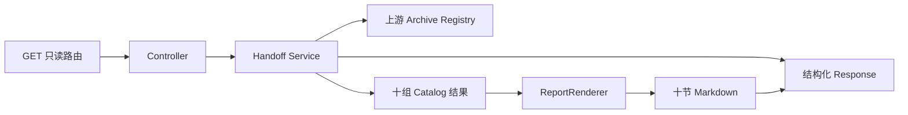

# v1878 发布归档移交渲染引擎代码讲解

本版本处理的是发布验收证据链靠近末端的一段只读汇总逻辑。它不增加新接口，也不改变任何既有字段，而是把原先分散在十二个一次性类里的 Markdown 组合行为，收敛成一个有类型约束的 `ReportRenderer`。理解这一刀时，不能只看“删除了多少文件”，还要看输入从哪里来、十组中间数据怎样形成、为什么输出必须逐行不变，以及新的结构怎样阻止同类膨胀再次发生。下面按一次真实请求经过本项目的顺序展开。

## 入口路由

外部读取从 `OpsShardReadinessReleaseAcceptanceArchiveVerificationHandoffController` 开始。控制器只承担 HTTP 适配，不参与证据计算：类上的 `@RequestMapping` 使用 `OpsShardReadinessReleaseAcceptanceRoutePaths.BASE_PATH`，方法上的 `@GetMapping` 使用 `RELEASE_ACCEPTANCE_ARCHIVE_VERIFICATION_HANDOFF_REGISTRY`，两段常量组合成既有只读地址。调用方不提交请求体、凭据值、写入参数或运行命令；输入只是一次 GET 请求，输出是 `OpsShardReadinessReleaseAcceptanceArchiveVerificationHandoffResponse`。

这种入口设计有两个重要含义。第一，路径所有权仍在 release-acceptance 的专用 RoutePaths 类型里，v1878 没有复制字符串，也没有悄悄另开兼容路由。第二，控制器把全部工作交给 `service.registry()`，因此 HTTP 层不会知道 Catalog 的数量、Markdown 的格式或上游证据的内部结构。以后若改变 Web 框架细节，业务证据组合不需要跟着移动；反过来，渲染器收敛也不会触碰请求映射。

可以把入口到输出的主干看成下面这条单向链路：

这里没有反向箭头。控制器不写数据库，渲染器不回调服务，上游 registry 也不会被本层修改。`@Transactional(readOnly = true)` 放在服务公开方法上，进一步把“这是读取与派生，不是执行与变更”变成框架可识别的约束。一次请求的明确输入是上游 registry 当前返回的证据快照，明确输出是同一份证据经过十类 Catalog 派生后的结构化响应和等价 Markdown 视图。

## 响应模型

响应不是一大段难以验证的字符串，而是由多个强类型记录组成。主要数据类型包括 `SourceArchiveSnapshot`、`VerificationRequirement`、`ArtifactCrossCheck`、`RouteHandoff`、`OperatorInstruction`、`CiProof`、`BoundaryGuard`、`RetentionGuard`、`CloseoutHandoff` 和 `ScorecardEntry`。每个列表都表达一种责任：来源快照回答“证据从哪里来”，要求列表回答“必须满足什么”，交叉核验回答“实际值是否与期望证据吻合”，路由和操作员列表回答“下一棒交给谁”，CI 与边界列表回答“哪些机械证明和禁止项已经成立”，保留与收尾列表回答“证据保存多久、怎样结束”，记分卡则对前九组结果做总览。

Markdown 只是这些结构化数据的只读投影。`MarkdownSection` 由标题和不可变行列表构成，最终响应同时保留原始 typed lists 与十个 section。这样，机器调用方可以读取字段，人工审查者可以读取文本，两者来自同一次服务计算，避免出现“JSON 说通过、说明文字却落后”的双源漂移。v1878 没有修改任何 record component、JSON 名称或列表顺序，因此序列化契约保持原样。

十节顺序被显式固定为 Source Archive、Verification Requirements、Artifact Cross Checks、Route Handoffs、Operator Instructions、CI Proofs、Boundary Guards、Retention Guards、Closeout Handoffs、Scorecard。每节第一行是计数，例如 `verification-requirement-count=8`；后续每行对应一个 typed entry。当前冻结输出一共十节、六十七行，其中六十七包含十条计数行。顺序属于契约，而不是展示偏好：下游若按段落定位证据，任意重排都可能让它读错上下文，所以 `List.of(...)` 的排列和逐行 oracle 一起守住这一点。

旧实现的问题不在功能错误，而在表达成本。十个 section renderer 分别把一组 record 拼成字符串，再由一个 aggregate renderer 组合，另有 support 类包装公共细节。每个类只完成一次调用，却拥有很长的家族前缀、独立文件和独立维护入口。响应模型本来已经提供清晰的类型边界，继续按“每节一个类”拆分只会把导航成本放大。新结构尊重数据边界，同时把同一种行为收回一个地方。

## 上游证据配置

服务的唯一上游依赖是 `ciarc` 包中的 archive-registry service。一次 `registry()` 调用先执行 `sourceArchiveRegistryService.registry()`，得到 release-acceptance archive registry 的只读结果。v1878 不读取磁盘归档、不访问 Node、不启动 mini-kv，也不把 URL 当作可连接目标；它只消费 Java 内存中的上游响应。测试样本中，上游版本为 `Java v1522`，profile 是对应 archive-registry 的 v1 标识，状态为 passed。这些值由上游负责，本层只是引用和核验。

拿到 source 后，九类基础 Catalog 各自做一项纯派生。SourceCatalog 提取来源快照；RequirementCatalog 根据来源形成八项验证要求；ArtifactCatalog 形成七项制品交叉检查；RouteCatalog 形成四项移交；OperatorCatalog 形成四条按顺序编号的操作说明；CiCatalog 形成五项 CI 证明；BoundaryCatalog 形成八条锁定边界；RetentionCatalog 形成五项保留规则；CloseoutCatalog 形成六项收尾交接。第十类 ScorecardCatalog 不直接重复读取上游，而是接收前九组已经形成的列表，计算九项总览。

这种配置方式把“数据是什么”和“文本怎样显示”分开。Catalog 决定版本、owner、expected、status 等业务数据，`ReportRenderer` 不能发明或修改这些值。假如未来某项检查从八条变为九条，应先修改对应 Catalog 和业务测试，再让计数渲染自然反映列表大小；不能为了得到好看的 Markdown 在 renderer 里塞一条文本。相反，若只改变文本分隔格式，则不应碰 Catalog。这个数据与行为边界是本次收敛能成立的前提。

上游依赖仍保持构造器注入。生产环境由 Spring 提供真实 archive-registry service，测试则通过 `HandoffTestData.service()` 注入 `ArchiveTestData.service()`。测试工厂虽然从超长类名缩短为 `HandoffTestData`，但它仍沿着公开构造器装配真实服务图，没有 mock 掉被测流程。输入因此既可控又忠于生产调用关系：测试固定上游样本，服务照常运行全部 Catalog、Support 和 renderer。

## 服务层核心流程

`registry()` 的核心流程是一次读取、九组基础派生、一组汇总、一次响应装配。首先将上游结果保存为局部变量 `source`，避免同一请求内重复读取可能变化的上游状态。随后按响应语义顺序计算各列表，每个局部变量都有短而清楚的领域名。Scorecard 最后接收前九个列表，所以它看到的计数与最终响应完全同源。`Support.response(...)` 再把版本、endpoint、profile、source、十组列表和 Markdown sections 放入公开 response。

v1878 对这条主流程只改变最后一个组合调用。旧代码调用长名 aggregate renderer，新代码调用 `ReportRenderer.render(...)`，传入参数、先后顺序和返回类型都不变。换句话说，服务层的控制流没有重写，风险被限制在纯函数式的文本投影上。若新渲染器产生任何不同，逐行 oracle 会直接指出第一处差异，而不是等到 HTTP 冒烟测试里凭肉眼找问题。

新的 `ReportRenderer` 是包内 `final` 类，构造器私有，没有 Spring 注解、成员状态、仓库依赖或网络客户端。公开给包内服务的只有一个静态 `render` 方法。该方法用 `List.of` 固定十个 section，并为每类 response record 提供一个私有映射方法。共通规则交给已经存在的 `MarkdownSections.counted`：它生成计数首行，把每个 entry 映射为文本，创建不可变行快照，再通过 `MarkdownSection::new` 构造目标类型。

真正有差异的部分仍是显式代码。例如 Verification Requirement 使用 `actual/expected` 和 `passed=true`，Route Handoff 使用 receiver、owner、packet 和 ready，CI Proof 使用 order、batch、commandFamily、readOnly 与 sourcePassed。`flag(name, value)` 与 `status(value)` 只统一布尔标签和状态前缀，不试图用反射或通用 Map 抹掉类型。这样既消除了十二个壳文件，又保留编译器对字段访问的检查。新增 record component 时，相关 mapper 会在编译或测试阶段暴露遗漏，而不是运行时才发现字符串 key 写错。

## Java 证据检查

本层对 Java 证据的检查不是重新执行发布，而是把上游已经形成的事实整理成可审阅的验收包。Source Archive 节确认唯一来源快照存在，并保留版本、endpoint、profile、registry state 和 status。Verification Requirements 的八项要求分别检查来源状态、七项 manifest、四个 route package、四个 operator pack、五项 CI attestation、八条 boundary seal、五个 retention window 和六条 closeout ledger。每行同时给出 actual、expected、证据说明、布尔 passed 和状态，避免只显示一个模糊的“成功”。

Artifact Cross Checks 再对关键来源字段做七项交叉核验，包括 release-acceptance 版本与状态、六个 readiness gate、六段 evidence chain、四个 signoff lane、五个只读 CI replay lane 和六个 closeout checkpoint。它的输入仍是 typed source，输出里的 `matched=true` 来自 Catalog 判定，不是 renderer 根据字符串猜测。Scorecard 最终把来源一项、八项要求、七项交叉检查、四项路由、四条操作说明、五项 CI、八条边界、五项保留和六项收尾汇总为九行 `actual/expected`。

这里的“通过”有清楚的机械含义。测试固定完整输出，例如 `verification-requirements=8/8 | status=passed`，同时也固定八条明细。若 Catalog 少产出一项，计数首行、明细行和 scorecard 至少会有一处失败；若有人只改 expected 让比值看起来正确，明细的逐行期望仍会失败。完整 Maven 门还会运行 Catalog 行为、响应不可变性、controller Markdown、上下游 route-path-split 和历史结构测试，使单点伪绿更难发生。

v1878 还把结构质量转化为可执行证据。目标家族从二十五个生产 Java 文件降到十四个，其中只允许一个短名 `ReportRenderer`；ops Java 上限从一千三百零四收紧到一千二百九十三；renderer 数从七十七降到六十七，总行数从四千三百七十六降到四千二百一十一，长 renderer 文件名从七十降到五十九。这些不是报告里的自述，而是 `OpsEleganceCensusTests` 和脚本会重新计算的上限。任何后来重新加入第二套 renderer 壳的提交都会让门失败。

## mini-kv 证据检查

本版本没有直接调用 mini-kv，这一点需要明确说透。Java 返回的 Boundary Guards 中包含 `no-mini-kv-autostart` 和 `no-mini-kv-write-admin`，含义是当前证据链只证明边界保持锁定：Node 不应通过这份移交材料自动启动 mini-kv，Java 也不会借只读验收接口开放 mini-kv 的写命令或管理命令。它不是“已经连到真实 mini-kv 并验证所有数据”的替代说法。

从一次请求的视角看，mini-kv 对本接口的输入为零：没有主机、端口、credential、命令文本或返回字节进入 `registry()`。输出中与 mini-kv 有关的是边界声明，具体为禁止自动启动与禁止写入管理能力。这种零输入本身就是安全属性。若未来跨项目 capstone 要读取真实 mini-kv，它必须在显式 opt-in 的集成层完成，保存新鲜命令输出，并继续证明没有写操作；不能把连接逻辑偷偷塞进这个 renderer 或 Catalog。

为什么一篇 Java 讲解仍要单列 mini-kv？因为这段 release handoff 最终服务于跨项目验收，读者很容易把“包含 mini-kv 边界条目”误解成“Java 已操作 mini-kv”。本项目在这里承担的是证据消费和边界陈述，不是 mini-kv 生命周期管理。`BoundaryGuard` 的 `lockedBehavior`、`auditEvidence`、`locked` 和 `status` 让这个区别可见：它报告锁是否存在，不把锁变成执行开关。

测试也按这个边界设计。`HandoffTestData` 只装配 Java 内部的 `ArchiveTestData`，不会启动进程或打开 TCP；focused Maven 测试无需 Docker 即可验证全部十节输出。以后若有人向 `ReportRenderer` 注入客户端、读取环境变量或解析 raw endpoint，类的纯静态结构和现有测试装配都会发生明显变化，代码审查和结构门可以及时阻止。这比在文档里泛泛写一句“只读”更透明。

## 阻断与安全边界

Boundary Guards 一共八条，分别锁住 Java 自动启动、mini-kv 自动启动、写路由、credential value、raw endpoint URL、managed audit HTTP/TCP、runtime shell 和 mini-kv write/admin。每条输出都带 code、locked behavior、audit evidence、`locked=true` 与 `status=passed`。这些字段由 BoundaryCatalog 提供，renderer 只做无副作用格式化，不能根据环境把 false 改成 true。

类结构本身也缩小了攻击与误用面。`ReportRenderer` 是 package-private，外部包不能把它当成新 API；它没有可变静态字段，不缓存响应，不读取文件，不拼接 SQL，不执行 shell，不建立 HTTP/TCP 连接。输入参数全部是已经构造好的列表，输出是 `List.of` 和 `MarkdownSections` 生成的不可变 section 集合。即使调用方保留原列表引用，共享引擎也会建立拥有权明确的快照，避免渲染结果在返回后被别处改写。

服务仍标注只读事务，并且 v1878 没有增加 repository、message publisher 或执行器依赖。控制器只有 GET。没有修改权限注解、路由常量、部署脚本、schema、fixture 字节或 credential 配置。下游 route-path-split 继续通过公开 handoff service 和 response 消费结果，而不是越过边界直接调用包内 renderer。因此，这一刀改善内部表达，却没有扩大任何跨包权力。

失败条件也写进版本设计：任一标题、内容行、顺序、计数或不可变语义变化就回退；修改 oracle、fixture 或 Catalog 数据只为让新实现变绿也回退；renderer 超过三百行或家族出现第二套 section engine 就回退；任一 renderer、长名、文件数、热点或 SpotBugs 豁免指标上升都回退。这些约束说明所谓优雅不是“看起来短”，而是在兼容、安全、可验证的前提下减少概念数量。

## 测试覆盖

测试顺序刻意分成改前、改后和全局三层。第一层是改前 oracle：在删除旧 renderer 之前新增 `HandoffMarkdownTests`，让它调用完整 service graph，并逐节、逐行断言十节六十七行。该测试先对旧实现通过一项中的一项，证明期望不是根据新实现倒推出来的。随后删除十二个旧类、接入 `ReportRenderer`，不改 oracle 任何期望，再运行同一测试并再次通过。

第二层是聚焦回归。本版本已运行六十八项测试，结果为零失败、零错误、零跳过。它覆盖五组 handoff 行为测试、controller Markdown、下游 route-path-split 的 Catalog、兼容性、不可变性、renderer 与 controller，还覆盖 v1847 至 v1850、v1866 的历史结构门，以及 `JavaEleganceGateTests`、`JavaChangeGateTests` 和 `OpsEleganceCensusTests`。因此，证据同时回答“文本是否相同”“上下游是否还能装配”“家族是否真的缩小”“长名基线是否只减不增”。

第三层是在本篇讲解和归档 manifest 完成后执行完整 `mvnw -B verify`。这样做的顺序很重要：文档也受 CurrentWalkthrough、ArchiveRetention、Spotless、JaCoCo 与 closeout 门约束，若先跑最终 verify 再补文档，所谓最终证据就没有覆盖最终树。完整门还包括编译全部生产与测试源码、全部单元和非 Docker 回归、覆盖率 floor、SpotBugs、格式检查与可执行 jar 打包。最终提交后再由 canonical GitHub Actions 在 Linux 上重复 headless 与 Docker 分工。

测试工厂也被纳入优雅治理。旧的超长 `OpsShardReadinessReleaseAcceptanceArchiveVerificationHandoffTestSupport` 改为 `HandoffTestData`，提供 `service()` 和 `registry()` 两个直白入口。五个本家族测试、根控制器测试和下游 route-path-split fixture 全部复用它。测试代码因此少一个超长文件 stem、减少十七次长标识符使用，同时仍然装配真实服务，不以 mock 掩盖结构问题。

## 实际工作量说明

这不是把十二个文件机械合并成一个大文件。工作先从依赖图和生产引用开始：确认外部只消费公开 service/response，renderer 内部没有跨包调用；再记录旧实现的十节六十七行真实输出；先写不依赖新实现的 oracle 并让旧代码通过；随后创建不超过十行的 family design，复用既有 `MarkdownSections.counted`，实现二百三十行 typed renderer；最后才删除十个 section renderer、一个 aggregate renderer 和一个 support。

结构结果是生产 Java 一千四百三十六降到一千四百二十五，ops 一千三百零四降到一千二百九十三，目标家族二十五降到十四。renderer 文件七十七降到六十七，renderer 总行数四千三百七十六降到四千二百一十一，长 renderer 文件名七十降到五十九。生产长文件 stem 一千二百四十三降到一千二百三十一，长标识符使用二万零八百五十一降到二万零七百六十五，唯一长名二千八百零二降到二千七百九十。测试侧虽然因新增 oracle 总文件数加一，但长 stem、长标识符使用和唯一长名全部下降。

更关键的收益是未来修改路径。旧结构若调整十节共同的计数规则，需要检查十个 renderer 和 support；新结构的共同规则在 `MarkdownSections.counted`，本家族只声明十个 typed mapper。新增类似家族时，三次规则会要求先复用 engine，而不是继续复制壳类。家族门又明确只允许 `ReportRenderer`，所以这种收敛不是一次性的清扫，而是把正确形状写进构建。

代码讲解要求至少三千汉字，目的不是制造篇幅。这里坚持“禁止硬凑”：每段都对应真实入口、真实 record、真实 Catalog、真实测试或真实机械指标；若一个版本没有足够的机制值得解释，应扩大实际重构工作，而不是重复结论。v1878 的工作量来自行为冻结、依赖核验、生产收敛、测试工厂改名、五类 ratchet 更新、归档证据和完整 CI 闭环，它足以独立构成一个有工程含量的版本。

## 一句话总结

v1878 把发布归档移交从十二个一次性渲染壳收敛为一个短名、包内、无状态、强类型的 `ReportRenderer`，并用改前改后完全相同的十节六十七行 oracle 证明输出没有变化；输入仍是唯一上游 archive registry，输出仍是结构化响应加只读 Markdown，Java、Node 与 mini-kv 的执行和写入边界没有被打开。

从使用者角度，什么都不需要改变：仍然请求同一个 GET 地址，仍然收到同样顺序、同样字段和同样文本。从维护者角度，必须理解和导航的 renderer 概念显著减少，共同计数算法只有一个来源，差异由编译器可检查的 record mapper 表达。从审查者角度，六十八项聚焦回归、精确逐行 oracle、家族唯一 renderer 门、全局 census 和最终完整 verify 构成可复现证据。它不是九分优雅的终点，但确实把本项目从“按段落堆类”推进到“数据归 Catalog、组合归 engine、边界归机械门”的更成熟形态。
