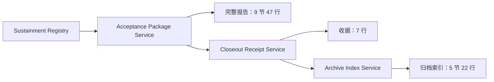

# v1879 发布验收包三输出渲染器收敛代码讲解

本版本继续处理发布验收证据链，但目标与 v1878 不同。v1878 收敛的是一份报告内部按章节拆散的渲染类，v1879 面对的是一条连续的三阶段输出链：先生成完整的 sustainment acceptance package，再由它生成 closeout receipt，最后由 receipt 生成 closeout archive index。旧代码为这三类输出保留了十二个超长 renderer 和一个 support，类名携带整条历史路径，真正的行为却只是把已经存在的 record 映射成 Markdown。此次重构先冻结旧实现的全部九节四十七行、七行收据、五节二十二行索引，再用三个短名、无状态、包内 renderer 替换旧结构。下面从一次真实 GET 请求的输入、转换和输出讲清楚为什么这不是简单改名，而是在不改变契约的前提下重新建立职责边界。

## 入口路由

本族有三个只读入口，对应三种不同审阅深度。第一条入口由 `OpsShardReadinessReleaseAcceptanceRoutePathSplitSustainmentAcceptancePackageController` 暴露，返回完整 acceptance package。第二条由 closeout receipt controller 暴露，把完整报告压缩成七项已接受标准。第三条由 closeout archive index controller 暴露，为归档维护者生成来源、标准回声、归档项、验证门和交接说明。三个控制器都留在根 `ops` 包中，以便 Web 边界继续清楚可见；业务实现则位于 `ops.maintenance.releaseacceptancepackage`。

路径仍由 `OpsShardReadinessReleaseAcceptanceRoutePaths` 统一持有。控制器没有复制字面 URL，也没有因为 renderer 更名而创建新地址。请求输入只是一条 GET，没有 request body、命令、credential value、raw endpoint 或写入参数。控制器把调用直接委托给三个公开 service 中相应的 `registry()`、`receipt()` 或 `index()`。因此，对外调用方看不到 `ReportRenderer`、`ReceiptRenderer` 和 `ArchiveIndexRenderer`，也不需要知道内部类已被替换。

三条入口不是彼此平行地重新读取所有来源，而是形成一条有方向的只读链：

箭头说明数据依赖，而不是执行许可。第一段读取上游 sustainment registry，第二段读取第一段的响应，第三段读取第二段的响应。任何一层都不会反向修改来源，也不会触发部署、回滚或 sibling startup。三个公开方法都标注 `@Transactional(readOnly = true)`，Web 路由又保持 GET-only，使“输入是证据快照，输出是派生视图”同时落在 HTTP、事务和类型边界上。

## 响应模型

完整 acceptance package 的 response 同时包含结构化数据和九个 `MarkdownSection`。结构化部分由 `SourceSnapshot`、`VersionLineage`、`DecisionRecord`、`ArchiveItem`、`ReviewItem`、`CiEvidence`、`RuntimeBoundary`、`NextChangeRule`、`ScorecardEntry` 九类 record 组成。它们分别回答来源是什么、版本如何串联、哪些决定被接受、哪些材料需要归档、谁负责复核、CI 必须证明什么、运行边界锁住什么、下一次变化落到哪里、整体是否通过。Markdown 不是另一套业务事实，只是这九组 typed list 的人工可读投影。

主报告固定九节。当前样本中，Source Sustainment 一行，Version Lineage 三行，Acceptance Decisions 六行，Archive Items 五行，Review Checklist 五行，CI Evidence 五行，Runtime Boundaries 七行，Next Change Rules 六行，Acceptance Scorecard 九行，总计四十七行。每节的标题、次序和每行字段排列都是可观察行为。比如 decision 行必须保持 `owner` 在前、`accepted` 在后，runtime boundary 行必须保持 `policy` 与 `locked`，不能因为重构看起来更整齐就重新排序。

closeout receipt 是另一种 response，不是主报告中的一个普通 section。它保留 `AcceptedCriterion` 列表、七行 Markdown、九项 checks、source version、endpoint、profile、归档标识和最终 status。七项标准依次验证 acceptance package 状态、三段 lineage、六项 decision、五项 archive、五项 CI、七条 runtime boundary 和六条 next-change rule。`accepted` 的计算仍在 service 中完成，renderer 不决定是否通过，只负责把每项 `name/status/evidence` 映射为一行。

archive index 的 response 又拥有独立的五类 record：`SourceSnapshot`、`CriteriaEcho`、`ArchiveIndexItem`、`VerificationGate`、`HandoffNote`。五节当前分别是一行、七行、五行、五行、四行，共二十二行。这说明为什么不能把三个输出硬塞进一个带 `mode` 参数的万能 renderer。它们共享“把 typed entry 映射为文本”的机制，但数据模型、调用时机、审阅对象和返回类型都不同。v1879 用三个短类型承认这种差异，又避免按每个标题继续制造一次性文件。

## 上游证据配置

第一阶段的唯一上游是 `OpsShardReadinessReleaseAcceptanceRoutePathSplitSustainmentService`。`registry()` 只调用它一次，把结果保存在局部变量 `source`，随后交给九个 Catalog。SourceCatalog 提取 `Java v1604` 的 sustainment 来源快照；LineageCatalog 形成 route-path-split、closeout 和 sustainment 三阶段版本链；DecisionCatalog 形成六项接受决定；ArchiveCatalog、ReviewCatalog、CiCatalog、RuntimeBoundaryCatalog 和 NextChangeCatalog 分别形成五、五、五、七、六项数据；ScorecardCatalog 最后使用前八组结果形成九项汇总。

第二阶段不回到最初上游，而是把第一阶段 `registry()` 的完整响应作为 source。CloseoutReceiptCriteriaCatalog 从它提取七项接受标准。service 仍负责真正的判定：source 状态必须是 passed，版本必须是 `Java v1634`，所有 criterion 状态必须是 accepted。随后它生成九项 checks，并把 `ReceiptRenderer.render(criteria)` 的七行结果与原始 criteria 一起放入 response。这里的数据边界非常明确：Catalog 说明“应检查什么”，service 说明“整体是否接受”，renderer 说明“怎样显示”。

第三阶段读取 closeout receipt。五个 ArchiveIndex Catalog 分别提取 source snapshot、criteria echoes、archive items、verification gates 和 handoff notes。`ArchiveIndexRenderer` 接收这五组已经完成的 typed list，生成五节 Markdown；support 再把 source 元数据、结构化列表与 Markdown 一次装入公开 response。此层不会重新推导 acceptance package 的业务决定，也不会绕过 receipt 去读第一层，这使归档索引能够明确证明它索引的正是已经收口的收据。

测试工厂按相同依赖方向装配真实服务图。`PackageTestData.service()` 注入 sustainment test service，`ReceiptTestData.service()` 注入 package service，`ArchiveIndexTestData.service()` 注入 receipt service。三个短名工厂替代了三个携带完整历史路径的 `*TestSupport`，但没有把核心流程 mock 掉。测试输入仍是可复现的上游样本，输出仍经过全部 Catalog、判定、support 和 renderer，这让兼容性测试覆盖真实组合路径。

## 服务层核心流程

主 service 的流程可以概括为“一次来源读取，八组独立派生，一组汇总，双视图响应”。每个 Catalog 的结果先进入有含义的局部变量，再同时传给 Scorecard、`ReportRenderer` 和 response support。这个顺序保证结构化列表与 Markdown 使用同一批对象，不会因为重复调用 Catalog 而出现计数不同步。`ReportRenderer` 不持有 service，也不读取 source service；它只接收九个列表，所以输入和输出都可以在纯内存中验证。

新的 `ReportRenderer` 是 package-private `final` 类，私有构造器阻止实例化，唯一包内入口是静态 `render`。它用 `List.of` 固定九节顺序，并为每种 record 提供一个短的私有映射方法。共同的 section 建立逻辑交给既有 `MarkdownSections.mapped`：该引擎接收标题、entries、typed mapper 和 section factory，生成拥有明确元素类型的不可变列表。这里没有反射、字符串字段名或通用 Map，record component 写错会在编译期暴露。

`ReceiptRenderer` 只有一个行为：把 `AcceptedCriterion` 流映射为七行，并以 `toList()` 返回不可变结果。它没有读取 `accepted` 总状态，也没有重复 service 中的版本检查。`ArchiveIndexRenderer` 与主报告结构相似，但它构造的是 archive-index response 自己的 `MarkdownSection` 类型，五个 mapper 分别处理五类 record。两种 section 类型虽然名称相同，却属于不同 response，显式 factory `MarkdownSection::new` 保持了编译器边界。

旧结构的十二个 renderer 以 Markdown 标题作为类边界，例如 ArchiveRenderer、CiRenderer、DecisionRenderer、LineageRenderer、ReviewRenderer、RuntimeBoundaryRenderer、ScorecardRenderer 和 SourceRenderer，再由超长 aggregate Renderer 与 RendererSupport 串起来。问题不是类多本身，而是这些类没有独立生命周期、状态或复用者，修改一份报告要在许多名字几乎相同的文件间移动。新结构按“一个真实输出产品一个 renderer”分界，因此删除十三个文件后只新增三个，包从三十六个生产类降到二十六个，同时没有产生一个超过现有热点阈值的巨型文件。

## Java 证据检查

Java 证据首先体现在完整报告本身。Source Sustainment 固定上游版本、状态和 profile；Version Lineage 证明 `Java v1570`、`Java v1579`、`Java v1604` 三阶段顺序存在；Acceptance Decisions 明确六项 owner 与 accepted；Archive、Review 和 CI 各给出五项可核验记录；Runtime Boundaries 逐项声明七种锁；Next Change Rules 为六类未来变化指定 landing zone 与 reviewer；Scorecard 再从前八组列表得出九项 passed 结果。renderer 只读取这些字段，不会把 blocked 值美化成 passed。

收据层提供第二次机械压缩。七个 `AcceptedCriterion` 都携带 evidence，例如 `lineage-count=3`、`decision-count=6`、`archive-items=5`、`ci-evidence=5`、`runtime-boundaries=7` 和 `next-change-rules=6`。service 的总状态还同时检查来源版本和来源 status。也就是说，报告中的结构数量、收据中的证据文字和收据的最终 status 互相约束，少一条 Catalog 项不会只造成一处静默变化。

归档索引提供第三次交叉检查。Criteria Echoes 重放七项 accepted criterion；Archive Items 明确 response、ledger、Markdown、checks 和版本标签五类保留对象；Verification Gates 要求 focused tests、关联 route-path-split tests、远端 CI、运行关闭和 sibling startup 关闭；Handoff Notes 指定 archive curator、release reviewer、route owner 和 CI maintainer。它不是重新声称“系统已经部署”，而是说明哪些只读证据应该被保存、谁应接收、哪些门仍必须通过。

结构优雅也被转成 Java 可执行证据。`OpsEleganceCensusTests` 将全局 renderer 上限从六十七收紧到五十八，总行数从四千二百一十一收紧到三千九百七十三，长 renderer 文件名从五十九收紧到四十七；目标包最多二十六个生产 Java 文件，且 renderer 文件名必须恰好是 `ReportRenderer.java`、`ReceiptRenderer.java`、`ArchiveIndexRenderer.java`。全局 ops 文件上限从一千二百九十三收紧到一千二百八十三。名称门还把生产长文件 stem、长标识符出现次数与唯一集合固定为新的只减不增 baseline。因此，“以后不要再长回来”不是愿望，而是构建失败条件。

## mini-kv 证据检查

本版本不连接 mini-kv，也不声称进行了真实 mini-kv 联调。三个 service 的构造器依赖都指向 Java 内部只读 service；三个 renderer 的参数都是 Java record 列表。请求没有 host、port、command、credential 或 value，生产代码没有 socket、process builder、shell 或 mini-kv client。对 mini-kv 而言，本接口的直接输入与直接输出都是零，只有跨项目治理层会读取这里保存的边界证明。

主报告中的 Runtime Boundaries 包含 `sibling-autostart`，收据 checks 中包含 `no-sibling-service-startup`，archive index 的 Verification Gates 中也保留 `sibling-startup-closed`。这三处不是重复口号，而是在三个审阅层次确认同一边界：完整报告说明策略被锁定，收据说明收口过程没有启动 sibling，归档索引说明保存证据时仍需检查关闭状态。任何层都没有把 locked 布尔值转换成启动开关。

如果将来跨项目 capstone 需要真实执行 `minikv_cli`，应由显式 opt-in 的集成套件启动并记录新鲜输出，还要机械证明没有写命令。它不能借此次 renderer 重构偷偷进入 package service，更不能由 Markdown 内容驱动进程。把这个非目标写清楚，是为了避免读者看到 `ready=true` 或 `passed=true` 就误以为 Java 已经控制 mini-kv 生命周期。

这种零连接设计也提高了测试可重复性。`PackageMarkdownTests` 在没有 Docker、网络或 sibling 进程的环境中即可运行，失败只可能来自 Java 数据或格式变化，而不是外部端口抖动。跨项目真实性与单项目确定性属于两种不同证据，本版本只改善后者的可维护实现，并保持前者的执行入口关闭。

## 阻断与安全边界

七条 Runtime Boundaries 分别锁住 write routing、active shard router、credential value read、raw endpoint resolution、managed audit connection、deployment rollback 和 sibling autostart。每条记录都有 boundary、policy 和 locked。`ReportRenderer.boundaries` 只把这三个 component 映射为文本；如果 Catalog 返回 `locked=false`，输出就会如实显示 false，renderer 没有补默认值或条件分支来伪造绿色。

三个新类全部是包内、无状态、不可实例化的纯格式化器。它们没有 Spring stereotype，不进入依赖注入容器，不获得 repository、publisher、HTTP client 或文件系统句柄。输出由 `List.of`、`Stream.toList()` 和 `MarkdownSections.mapped` 建立不可变列表。service 继续保留 `@Transactional(readOnly = true)`，controller 继续使用 GET，公开 response 与 endpoint 不变，因而重构没有扩大跨包 API 或运行权限。

兼容性策略也有明确阻断线。先在旧实现仍存在时运行 `PackageMarkdownTests`，三项 oracle 全部通过，证明期望来自历史输出。替换生产实现后不修改任何期望，再运行同一测试仍为三项通过。若标题、行序、空格、布尔值或 evidence 任一字符变化，`containsExactly` 会失败。禁止通过更新 fixture、删行或改成模糊 `contains` 来换取绿色，这也是本项目“证据先于结论”的具体落实。

版本失败条件还包括：包内出现第四个 renderer；任一新 renderer 改成长名；全局文件、行数或名称 ratchet 被放宽；service chain 被绕开；renderer 开始决定业务状态；新增写路由、连接、进程启动或部署行为；Spotless、SpotBugs、JaCoCo、完整 Maven verify 或 canonical CI 任一不通过。代码更短并不足以称为优雅，必须同时保持契约、权限、可读性和可验证性。

## 测试覆盖

测试分为行为冻结、聚焦回归、全量门与远端复验四层。第一层只有三个测试，却是最强的兼容证据。`preservesEveryLegacyReportLine` 精确列出九节四十七行；`preservesEveryLegacyReceiptLine` 精确列出七行；`preservesEveryLegacyArchiveIndexLine` 精确列出五节二十二行。它们调用真实三段 service graph，而不是直接调用新 renderer，因此 Catalog、判定、response support 和渲染全部在覆盖范围内。

第二层聚焦回归已执行七十一项，零失败、零错误、零跳过。除了三项新 oracle，还包含原有 Catalog、不可变性和 renderer 测试，三个根 controller-oriented 测试，v1842 的提取边界，v1847 至 v1850 和 v1866 的全局 ops 计数门，以及 `JavaEleganceGateTests`、`JavaChangeGateTests`、`OpsEleganceCensusTests`。首轮门曾准确拒绝三个新增长测试方法名，修复方式是把方法缩短到四十字符预算内并重建 baseline，而不是豁免或放宽断言。这次失败本身证明优雅门能够工作。

第三层是讲解、归档与完整 `mvnw -B verify`。讲解必须在最终 verify 之前写入，当前讲解门会检查文件名、十个固定标题、至少三千汉字以及“禁止硬凑”和“本项目”。归档门会把本篇加入白名单，重新生成 manifest，并固定文件数量和字节总量。完整 verify 再编译全部一千四百一十五个生产文件和八百九十八个测试文件，运行所有非 Docker 测试、JaCoCo floor、SpotBugs、Spotless 与 jar 打包，确保文档加入后的最终树也受验证。

第四层是两个提交的 canonical CI。实现提交推送后先等待 GitHub Actions 完成 headless verify 与 Docker 分工；只有实现 CI 绿色，才补远端 run 证据、提交 closeout 文档并再次推送。第二次 CI 证明最终证据树在远端也绿色，随后创建 annotated tag，并核对 tag object 与 peeled commit。这样 tag 指向的不是“本地大概通过”的中间树，而是已经被两轮远端门确认的最终版本。

## 实际工作量说明

此次工作不是把类名换短后直接提交。第一步通过 CodeGraph 和源码引用确认十二个旧 renderer 只有包内消费者，外部生产代码只通过三个 public service/response 与根 controller 交互。第二步在旧实现仍运行时捕获三类完整输出，并把九节四十七行、七行、五节二十二行全部写成精确 oracle。第三步先让旧实现 3/3 通过，再引入三个短 renderer，切换 service，删除十二个 renderer 与一个 support，随后让完全未改的 oracle 再次 3/3 通过。

第四步清理测试导航成本。三个历史 `*TestSupport` 名称同样携带整条领域路径，被替换为 `PackageTestData`、`ReceiptTestData`、`ArchiveIndexTestData`。九个包内测试和三个根测试的引用同步更新，仍装配真实服务链。第五步把历史 v1842 结构测试从“这三十六个文件必须永远存在”改造成“提取边界必须存在、当前实现最多二十六个、十三个旧 renderer 必须消失、测试工厂必须短名”。它保留历史架构事实，同时不阻止后续优化。

最终结构数据是：生产源码总数一千四百一十五，ops 从一千二百九十三降到一千二百八十三，目标包从三十六降到二十六；renderer 从六十七降到五十八，总行数从四千二百一十一降到三千九百七十三，长 renderer 文件名从五十九降到四十七。本包 renderer 只剩三个，共二百二十七行。生产长文件 stem 从一千二百三十一降到一千二百一十八，长标识符使用从二万零七百六十五降到二万零六百九十六，唯一长名从二千七百九十降到二千七百七十七。测试新增一份 oracle 后总数为八百九十八，但测试长 stem、长标识符使用和唯一长名仍继续下降。

这些指标说明收益不是把代码搬去测试或文档。生产文件净减十个，renderer 净减九个，十二个长 renderer 文件名全部消失，测试工厂也变短；超过五百行的生产热点仍为三十二个，最大文件仍是七百三十八行，没有新巨型类。三个输出保持各自 renderer，避免另一个万能类；共同 section 行为复用现有 `MarkdownSections`，避免复制。这里坚持“禁止硬凑”：讲解每一段都对应真实类型、真实调用链、真实输出或真实门。若工作量不足以解释三千汉字，应扩大重构范围，而不是重复同一句结论。

## 一句话总结

v1879 把 release acceptance package 的十二个长名渲染壳与一个 support 收敛为 `ReportRenderer`、`ReceiptRenderer`、`ArchiveIndexRenderer` 三个按真实输出分界的短名纯函数组件，并用改前改后完全相同的九节四十七行、七行、五节二十二行 oracle 证明对外行为没有变化。输入仍沿 sustainment registry 到 package、receipt、archive index 单向流动，输出仍同时保留 typed response 与 Markdown，Java 没有打开写入、连接、部署、回滚或 sibling startup。

从调用者看，三个 GET 路由、response 字段、版本、顺序和文本保持原样；从维护者看，修改一份输出不再跨越十二个历史前缀文件，共同映射机制只有一个来源，三个输出的差异仍由编译器检查；从审查者看，三项精确 oracle、七十一项聚焦测试、名称 baseline、renderer census、ops 上限、归档 manifest、完整 verify 和双阶段 CI 组成可以复现的证据链。它还不是整个仓库 coding brilliant and elegant 9 分的终点，但这一刀把“按 Markdown 标题造类”改成“数据归 Catalog、判定归 service、表现归输出 renderer、退化由机械门阻断”，是向九分目标迈出的可量化一步。
